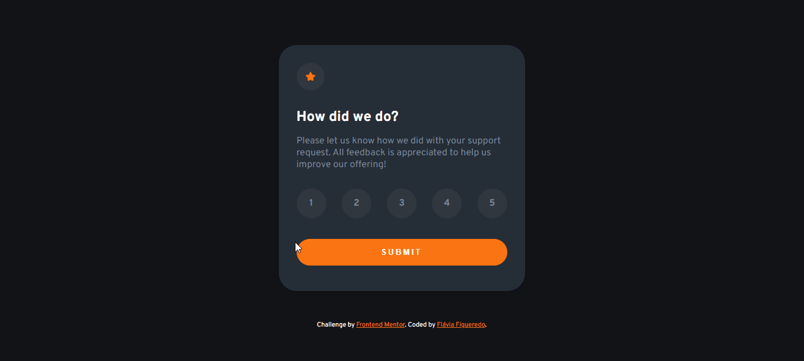

# Frontend Mentor - Interactive rating component solution

This is a solution to the [Interactive rating component challenge on Frontend Mentor](https://www.frontendmentor.io/challenges/interactive-rating-component-koxpeBUmI). 🚀

## Table of contents

- [The challenge](#the-challenge)
- [Screenshot](#screenshot)
- [Links](#links)
- [Built with](#built-with)
- [Author](#author)

### The challenge

Users should be able to:

- View the optimal layout for the app depending on their device's screen size
- See hover states for all interactive elements on the page
- Select and submit a number rating
- See the "Thank you" card state after submitting a rating

### Screenshot

### Links

- [GitHub repository](https://github.com/flaviafigueredo/interactive-rating-component-main)
- [GitHub pages](https://flaviafigueredo.github.io/interactive-rating-component-main/)

### Built with

- HTML5
- CSS
- JavaScript

## Author

- Portfolio - [Flávia Figueredo](https://flaviafigueredo.github.io/mini-portfolio/)
- LinkedIn - [@flaviafigueredo](https://www.linkedin.com/in/flaviafigueredo/)